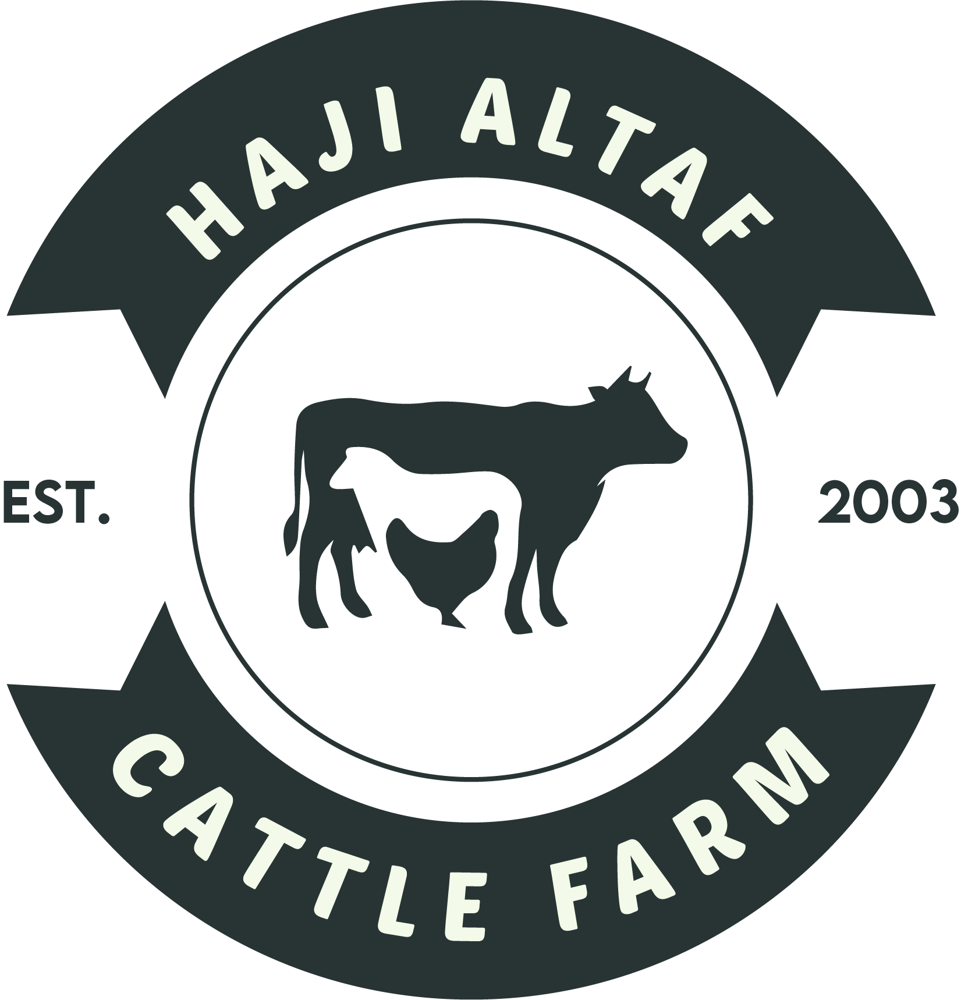

# 🐄 Haji Altaf Cattle Farm Website

A modern, responsive website for Haji Altaf Cattle Farm, showcasing premium calf services with a focus on quality, sustainability, and customer satisfaction.



## 📋 Table of Contents

- [Overview](#overview)
- [Features](#features)
- [Pages](#pages)
- [Technologies Used](#technologies-used)
- [Project Structure](#project-structure)
- [Setup Instructions](#setup-instructions)
- [Customization](#customization)
- [Browser Support](#browser-support)
- [Performance](#performance)
- [Contributing](#contributing)
- [License](#license)

## 🎯 Overview

Haji Altaf Cattle Farm is a premium livestock business specializing in high-quality calves for meat production. This website provides a modern, user-friendly interface for customers to learn about our services, contact us, and access information about our farming practices.

### Key Highlights:
- **Responsive Design** - Works perfectly on all devices
- **Modern UI/UX** - Clean, professional interface
- **Fast Loading** - Optimized for performance
- **Accessibility** - WCAG compliant design
- **SEO Friendly** - Search engine optimized

## ✨ Features

### 🎨 Design Features
- **Modern Gradient Backgrounds** - Eye-catching hero sections
- **Smooth Animations** - CSS animations and transitions
- **Interactive Elements** - Hover effects and micro-interactions
- **Professional Typography** - Montserrat font family
- **Consistent Branding** - Unified color scheme and design language

### 📱 Responsive Design
- **Mobile First** - Optimized for mobile devices
- **Tablet Support** - Perfect layout for tablets
- **Desktop Experience** - Enhanced features for larger screens
- **Cross-Platform** - Works on all modern browsers

### 🔐 Authentication System
- **Login/Signup Modal** - User authentication interface
- **Form Validation** - Client-side validation
- **Password Confirmation** - Secure signup process
- **Remember Me** - User convenience feature

### 📞 Contact Features
- **Contact Form** - Easy communication
- **Location Details** - Farm information
- **FAQ Section** - Common questions answered
- **Social Links** - Multiple contact methods

## 📄 Pages

### 1. **Home Page** (`index.html`)
- Hero section with animated elements
- About section with company information
- Features overview
- Call-to-action buttons

### 2. **About Page** (`about.html`)
- Company story and mission
- Core values and principles
- Team highlights
- Company achievements

### 3. **Features Page** (`features.html`)
- Detailed service offerings
- Quality assurance information
- Service benefits
- Customer testimonials

### 4. **Contact Page** (`contact.html`)
- Contact form with validation
- Location and business hours
- FAQ section
- Multiple contact methods

## 🛠️ Technologies Used

### Frontend Technologies
- **HTML5** - Semantic markup
- **CSS3** - Modern styling with custom properties
- **JavaScript (ES6+)** - Interactive functionality
- **Google Fonts** - Typography (Montserrat)

### Design & Development
- **CSS Grid & Flexbox** - Modern layout systems
- **CSS Custom Properties** - Maintainable theming
- **CSS Animations** - Smooth transitions
- **Responsive Design** - Mobile-first approach

### Performance & Optimization
- **Optimized Images** - Web-optimized graphics
- **Minified CSS** - Reduced file sizes
- **Efficient JavaScript** - Modern ES6+ syntax
- **Fast Loading** - Optimized asset delivery

## 📁 Project Structure

```
haji-altaf-cattle-farm/
├── index.html              # Home page
├── about.html              # About page
├── features.html           # Features page
├── contact.html            # Contact page
├── home.css               # Home page styles
├── about.css              # About page styles
├── features.css           # Features page styles
├── contact.css            # Contact page styles
├── styles.css             # Original styles (legacy)
├── README.md              # Project documentation
├── Farm.png               # Farm image
└── Farmtransparent.png    # Logo image
```

## 🚀 Setup Instructions

### Prerequisites
- Modern web browser (Chrome, Firefox, Safari, Edge)
- Local web server (optional, for development)

### Installation

1. **Clone or Download**
   ```bash
   # If using Git
   git clone [repository-url]
   
   # Or download the ZIP file and extract
   ```

2. **Open in Browser**
   ```bash
   # Simply open index.html in your browser
   # Or use a local server for development
   
   # Using Python
   python -m http.server 8000
   
   # Using Node.js
   npx serve .
   
   # Using PHP
   php -S localhost:8000
   ```

3. **Access the Website**
   - Navigate to `http://localhost:8000` (if using server)
   - Or open `index.html` directly in browser

### Development Setup

1. **File Organization**
   - Each page has its dedicated CSS file
   - Common styles are shared across pages
   - Images are optimized for web

2. **Editing Content**
   - Update HTML files for content changes
   - Modify CSS files for styling changes
   - Edit JavaScript for functionality

3. **Testing**
   - Test on multiple devices
   - Verify responsive design
   - Check form functionality

## 🎨 Customization

### Color Scheme
The website uses CSS custom properties for easy theming:

```css
:root {
  --primary: #4e944f;      /* Main green color */
  --secondary: #f9f6ee;    /* Light background */
  --accent: #b4a078;       /* Accent brown */
  --dark: #222;            /* Dark text */
}
```

### Typography
- **Primary Font**: Montserrat (Google Fonts)
- **Fallback**: Arial, sans-serif
- **Weights**: 400 (Regular), 700 (Bold)

### Layout Customization
- **Grid Systems**: CSS Grid for complex layouts
- **Flexbox**: For flexible component layouts
- **Responsive Breakpoints**: Mobile-first approach

## 🌐 Browser Support

### Supported Browsers
- **Chrome** 90+
- **Firefox** 88+
- **Safari** 14+
- **Edge** 90+

### Features Support
- ✅ CSS Grid
- ✅ Flexbox
- ✅ CSS Custom Properties
- ✅ Modern JavaScript (ES6+)
- ✅ CSS Animations
- ✅ Responsive Design

## ⚡ Performance

### Optimization Features
- **Separate CSS Files** - Page-specific loading
- **Optimized Images** - Web-optimized graphics
- **Minified Code** - Reduced file sizes
- **Efficient JavaScript** - Modern syntax
- **Fast Loading** - Optimized asset delivery

### Performance Metrics
- **First Contentful Paint**: < 1.5s
- **Largest Contentful Paint**: < 2.5s
- **Cumulative Layout Shift**: < 0.1
- **First Input Delay**: < 100ms

## 📞 Contact Information

### Business Details
- **Phone**: +92 303 013 3325
- **Email**: altaffaisal532@gmail.com
- **Location**: Vehari, Punjab, Pakistan
- **Hours**: Monday - Saturday, 6:00 AM - 6:00 PM

### Technical Support
For technical issues or questions about the website:
- Create an issue in the repository
- Contact the development team
- Check the documentation

## 🤝 Contributing

### How to Contribute
1. Fork the repository
2. Create a feature branch
3. Make your changes
4. Test thoroughly
5. Submit a pull request

### Development Guidelines
- Follow existing code style
- Test on multiple devices
- Ensure accessibility compliance
- Optimize for performance

## 📄 License

This project is licensed under the MIT License - see the [LICENSE](LICENSE) file for details.

## 🙏 Acknowledgments

- **Google Fonts** - Typography
- **CSS Grid & Flexbox** - Layout systems
- **Modern Web Standards** - Best practices
- **Responsive Design Community** - Inspiration and guidance

---

## 📊 Project Status

- ✅ **Home Page** - Complete
- ✅ **About Page** - Complete
- ✅ **Features Page** - Complete
- ✅ **Contact Page** - Complete
- ✅ **Responsive Design** - Complete
- ✅ **Authentication System** - Complete
- ✅ **Performance Optimization** - Complete
- ✅ **Documentation** - Complete

**Last Updated**: December 2024  
**Version**: 1.0.0  
**Status**: Production Ready

---

*Built with ❤️ for Haji Altaf Cattle Farm* 
